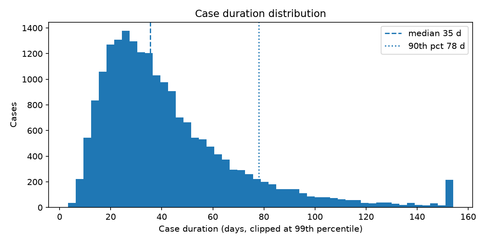
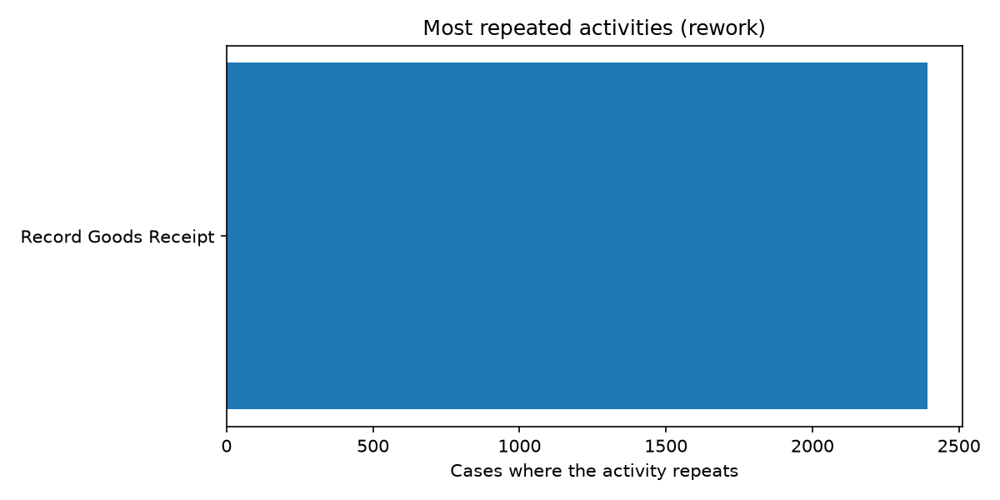
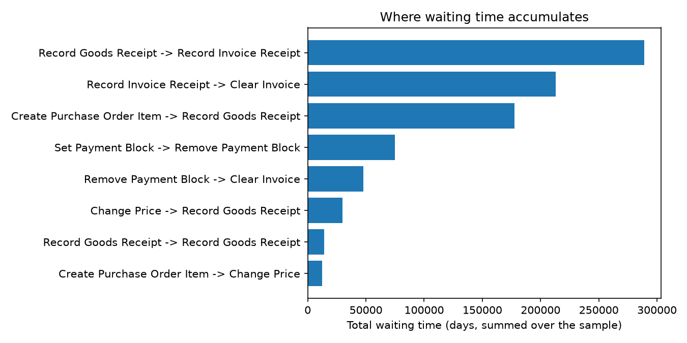

# Purchase-to-Pay Process Mining and Early-Warning Automation

> 12% of cases involve rework. A simple early-warning rule flags 98% of late cases with a median of 67 days of notice (precision 31%, 3.2x better than random picking).

**Data:** Synthetic (simulated purchase-to-pay log). Results show the method working, not real-world performance.

## Define

Purchase-to-pay cases often finish late because steps stall or repeat, and owners usually find out only after the case is already late. Goal: find where time is lost, then build an automation that warns the owner while there is still time to act.

## Measure

- 92,659 events across 20,000 cases
- Median case duration: 35.5 days; 90th percentile: 78.0 days
- 8 distinct process variants; the top 10 cover 100.0% of cases

## Analyze

**Rework.** 2,392 cases (12.0%) repeat at least one activity. Cases with rework take a median of 40.2 days versus 34.9 days without (+5.3 days). The most repeated activity is "Record Goods Receipt" (2,392 cases).

| Repeated activity | Cases | Share of cases |
|---|---|---|
| Record Goods Receipt | 2,392 | 12.0% |

**Where time goes.** The step transitions that accumulate the most waiting time:

| Transition | Times | Mean wait (days) | 90th pct wait (days) |
|---|---|---|---|
| Record Goods Receipt -> Record Invoice Receipt | 20,000 | 14.5 | 29.9 |
| Record Invoice Receipt -> Clear Invoice | 16,330 | 13.0 | 27.3 |
| Create Purchase Order Item -> Record Goods Receipt | 17,073 | 10.4 | 21.4 |
| Set Payment Block -> Remove Payment Block | 3,670 | 20.4 | 44.8 |
| Remove Payment Block -> Clear Invoice | 3,670 | 13.0 | 27.7 |

## Improve

An early-warning rule: raise an alert as soon as any step has waited longer than the 90th percentile wait for that step. Thresholds are learned from 70% of cases and the rule is scored on the other 30%, so the results are not measured on the data used to set the thresholds. "Late" means a total duration of at least 78.0 days (the slowest 10% in the training data).

## Control

| Metric (held-out cases) | Result |
|---|---|
| Cases tested | 6,000 |
| Cases flagged | 1,860 (31.0%) |
| Base rate of late cases | 10.0% |
| Precision (flagged cases that end up late) | 31.5% |
| Recall (late cases that were flagged) | 97.8% |
| Lift over random picking | 3.2x |
| Median warning before a late case finishes | 67 days |

`results/alerts.csv` lists every flagged case with the step that triggered the alert and the days of warning. Re-running `analyze.py` reproduces every number here.

## Limitations and next steps

- The event log is simulated, so the bottlenecks were designed into it. The value of this repo is the pipeline: discovery, an early-warning rule, and an honest train/test evaluation. Swap in a real log to get real findings.
- Precision is moderate: the rule trades some false alarms for catching most late cases. A production version would tune the threshold per team to control alert fatigue.
- The alert fires from timestamps in a log. A live version would need a feed from the ERP and a workflow to route alerts to case owners (for example with UiPath or Celonis Action Flows).

## How to run

1. `pip install pm4py pandas numpy matplotlib`
2. Put the event log in `data/` (see `analyze.py` for the expected file) or run `python simulate_p2p.py` for simulated data
3. `python analyze.py` produces the results and charts
4. `python make_readme.py` rebuilds this README from the results
